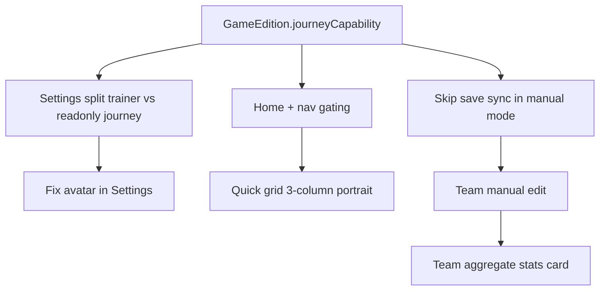

# Journey / Trainer / Team — Product plan (Tito confirmed, not implemented)

> **Status:** Analysis + requirements only. Batch with other dex/detail UX changes.
> **Audience:** Tito + Cloud Agents.

---

## Summary

TitoDex should split into two **journey modes** driven by **Settings → global game version**:

| Mode | When | Home | Save sync | Team |
| --- | --- | --- | --- | --- |
| **Save-linked** | Game has readable local save (HGSS today) | Continue card + Journey tab | Auto / manual sync from `.sav` | From save + optional cosmetic overrides |
| **Manual / dex-only** | NS-era, mobile, or no parser (SV, LZA, Champions, …) | No Continue card, no Journey tab | **Do not attempt** save read | User-built party; full edit |

Settings becomes the place for **trainer display name + avatar**. Journey facts (location, badges, play time) become **read-only** when save-linked.

---

## 1. Trainer avatar — broken, move to Settings

### Current behavior

| Piece | Location | Notes |
| --- | --- | --- |
| Pick + crop | `TrainerAvatarService` (`image_picker` + `image_cropper`) | Errors swallowed → `null`, no user-facing error |
| UI entry | Home `TrainerCard` tap only (`app.dart` → `_onTrainerAvatarTap`) | Not in Settings |
| Confirm UX | Double-tap if already customized | Easy to miss; feels broken |
| Storage | `CurrentJourney.trainerAvatarPath` → `trainer_avatar.jpg` in app documents | OK |
| Display | `trainer_card.dart` checks `File.existsSync` | Path loss after reinstall? |

### Likely failure modes (RG Android)

- `image_cropper` / `UCropActivity` theme or permission edge case on handheld
- Pick succeeds, crop returns `null`, user sees nothing
- No Settings entry → user forgets home tap exists

### Planned fix

- **Settings → Trainer** section: display name + **avatar row** (preview +「更换头像」)
- Remove or keep home tap as shortcut (TBD; Settings is primary)
- Surface errors (SnackBar) instead of silent `debugPrint`
- Verify `AndroidManifest.xml` `UCropActivity` + storage permissions on RG builds

---

## 2. Settings — trainer vs journey fields

### Tito request

| Field | Settings behavior |
| --- | --- |
| **Trainer display name** | Editable (keep `trainerNameCustomized` vs `saveTrainerName`) |
| **Trainer avatar** | Editable (gallery + crop) |
| **Location, play time, badges, reminder** | **Read-only** — only from save sync, no manual TextFields |
| **Journey timeline** | Read-only from save / parser (no manual edit in Settings) |

### Current (to remove)

`settings_page.dart` has editable `_locationController`, `_playTimeController`, `_badgesController`, `_reminderController` under「编辑旅程」— conflicts with「只读存档」.

### Planned UI

```
Settings
├── 训练家
│   ├── 显示名称 [TextField]
│   ├── 头像 [preview + 更换]
│   └── 全局游戏版本 [picker]  ← already exists (defaultGameEdition)
├── 旅程信息 (只读)          ← only visible in save-linked mode
│   ├── 当前地点 / 徽章 / 游戏时间
│   └── 来源：存档同步于 …
├── 存档与模拟器             ← only visible in save-linked mode
│   └── directory, sync, emulator (unchanged)
└── 图鉴离线包 …
```

---

## 3. Game version → journey mode gating

### Rule (Tito confirmed)

If **Settings global `GameEdition`** is **NS generation or mobile / no save**, then:

1. **Do not** run save directory scan / `HgssParser` sync for that profile
2. **Hide** home `ContinueJourneyCard`
3. **Hide** Journey tab (bottom nav + quick action)
4. **Quick actions:** 4 tiles → **3 tiles** (Team, Dex, Search — drop Journey)
5. **Portrait home:** `_QuickActionsGrid` is 2×2 today → **one row × 3** equal blocks
6. **Square home:** `_QuickActionsBar` already 4-in-a-row → **3-in-a-row**

### Proposed `GameEdition` capability flag

Add something like:

```dart
enum JourneyCapability {
  saveLinked,  // HGSS — HgssParser + Continue + Journey tab
  manual,      // NS / future — manual team, dex tools only
}
```

**Initial mapping (Tito intent):**

| Category | Examples | `JourneyCapability` | Save read |
| --- | --- | --- | --- |
| HGSS | 心金/魂银 | `saveLinked` | Yes (`HgssParser`) |
| Legacy handheld (future parsers) | Pt, BW, … | `saveLinked` when parser ships | When implemented |
| NS | SM, USUM, SwSh, SV, PLA | `manual` | **No** |
| Mobile / no API | LZA, Champions | `manual` | **No** |
| Retro without parser yet | RGB, DP, … | `manual` until parser | **No** |

**Important:** Today **only HGSS** has a working parser (`save_sync_service.dart` → `HgssParser`). Selecting Pt/BW in settings still won't read saves until parsers exist — gating should follow **capability**, not `journeyGameKey` alone.

### Touchpoints

| File | Change |
| --- | --- |
| `game_edition.dart` | `journeyCapability` (or `supportsSaveSync`) |
| `app.dart` | Skip `_syncSave` when manual mode |
| `home_page.dart` | Conditional Continue card; `_quickActions()` filter |
| `tito_bottom_nav.dart` | Hide `/journey` route item (4 → 3 nav slots?) |
| `go_router` | Journey route still reachable via deep link? Or 404 — TBD |
| `settings_page.dart` | Hide save directory section in manual mode |

### Bottom nav note

Today: Team | Journey | **Home** | Dex | Search (5 items).

If Journey removed: Team | **Home** | Dex | Search (4 items) — layout rebalance needed so center Home still works.

---

## 4. Team page — manual edit + richer UI

### Current

- `team_page.dart`: read-only `PartyTeamList` from `journey.party`
- `PartyMember`: species, level, nickname, HP, EXP — no IV/EV/nature/moves
- No edit, no add/remove, no team summary

### Tito request

1. **Dual source:** party from save **or** user-edited (especially manual journey mode)
2. **Edit existing members:** species, level, nickname, stats (expand model as needed)
3. **Team-level aggregate stats** — paired estimate for whole party (BST sum? type coverage? avg level? — see §5)

### Data model extensions (draft)

```dart
class PartyMember {
  // existing …
  int? natureId;
  Map<String, int>? ivs;   // hp/atk/def/spa/spd/spe
  Map<String, int>? evs;
  List<int>? moveIds;
  bool manualEntry;        // true if user-created vs save-imported
}
```

Persist via `CurrentJourney` JSON (already import/export in Settings).

### UI draft

```
Team · {game label}
├── [Team summary card]     ← NEW: aggregate stats
├── Party slot 1..6         ← tap → edit sheet
│   └── sprite, name, Lv, HP bar, EXP bar
├── [+ 添加宝可梦]           ← manual mode or override slot
└── Note / hint
```

Save-linked mode: editing might **override** display party while save fields remain source for location/badges — policy TBD (full override vs cosmetic-only).

---

## 5. Team aggregate stats — what to estimate

Tito: 「配对的整体队伍数值可以估算」— interface still too simple.

### Minimum viable (v1)

| Metric | Source | Use |
| --- | --- | --- |
| Party size / avg level | `PartyMember.level` | Quick power feel |
| Total BST | sum of base stats × species from dex CDN | Rough bulk |
| Type coverage | offensive types represented in party | Companion to battle tools |
| Physical vs special bias | avg Atk vs SpA BST | Lightweight |

Reuse existing:

- `stat_calc_page.dart` — single-Pokémon calc
- `type_chart.dart` — type matchup
- `dexRepository.getSummary(speciesId)` — base stats

### Nice-to-have (v2)

- Estimated damage range vs common types (heavy; links to quick damage tool)
- Weakness summary (team defensive profile)
- HP total / status of party

### UX

One **StickerCard** at top of Team page — compact rows, not a full battle calc.

---

## 6. Dependency graph (implementation order)



Suggested batch:

1. `journeyCapability` + UI gating (home/nav/settings save section)
2. Settings trainer + avatar fix; journey fields read-only
3. Team edit model + UI
4. Team summary card

---

## 7. Open questions (for Tito before coding)

1. **Home avatar tap** — keep as shortcut or Settings-only?
2. **Save-linked team edit** — allow overriding save party for display, or read-only party with manual mode only?
3. **Manual mode dex progress** — seen/caught from save flags disabled; use manual markers only?
4. **Bottom nav** — 4 items after dropping Journey, or replace Journey slot with something else (e.g. Settings shortcut)?
5. **NS games** — exact list: SM/USUM/SwSh/SV/PLA + LZA/Champions — anything else?

---

## Related docs

- [ROADMAP.md](../ROADMAP.md) — Phase B / home dashboard
- [PRODUCT.md](../PRODUCT.md) — journey companion positioning
- [AI_READFIRST.md](./AI_READFIRST.md) — agent quick ref
- Dex/detail UX: [ROADMAP.md](../ROADMAP.md) Phase E (list / obtain / moves)
