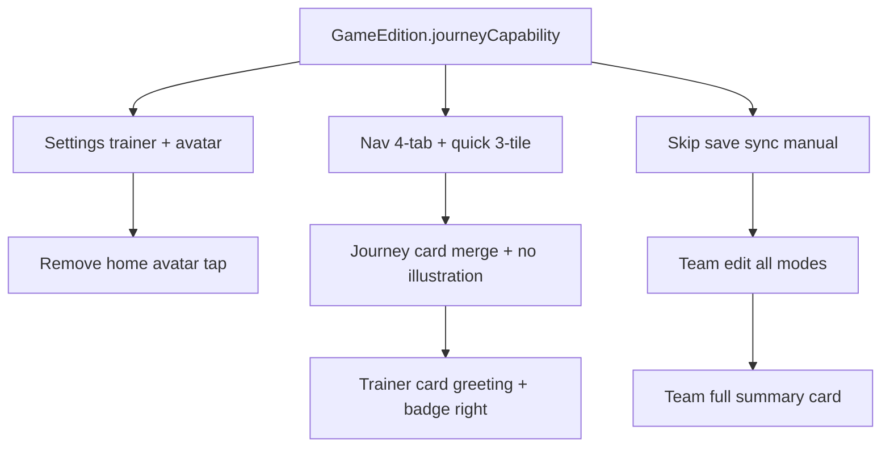

# Journey / Trainer / Team — Product plan (Tito confirmed)

> **Status:** Implemented on branch `cursor/batch-ux-journey-dex-947b` (2026-07). This doc remains the product spec reference.
> **Audience:** Tito + Cloud Agents.
> **Last updated:** 2026-07 (Tito decisions on avatar, team edit, nav, home merge, Sleep)

---

## Summary

TitoDex splits into two **journey modes** driven by **Settings → global game version**:

| Mode | When | Home | Save sync | Team |
| --- | --- | --- | --- | --- |
| **Save-linked** | Readable local save (HGSS today) | **Journey card** (merged Continue + detail) | From `.sav` | Default from save; **user can override** |
| **Manual / dex-only** | NS, mobile, no parser (SV, LZA, Champions, …) | No journey card | **Do not read** | Fully user-built |

**Settings:** trainer display name + avatar (only place to change avatar). Journey facts read-only from save when save-linked.

**Nav:** bottom bar **Team | Home | Dex | Search** (4 items). Quick tiles **Team / Dex / Search** (3). No Journey tab. Hand-drawn icon refresh later.

---

## Tito decisions (2026-07)

| # | Topic | Decision |
| --- | --- | --- |
| 1 | Home avatar tap | **Remove** — avatar changes **Settings only** |
| 2 | Team edit | **Both modes** — default from save; user can edit/add (non-emulator / other device play) |
| 3 | NS / mobile list | SM, USUM, SwSh, SV, PLA, LZA, Champions — **sufficient for now** |
| 4 | Bottom nav slot | **No replacement** — 3 quick tiles + 4-tab nav feels cleaner; custom icons later |
| 5 | Journey tab | **Merge into home journey card** — see §8 (recommended) |
| 6 | City illustrations | **Remove** all version-specific drawn maps — solid color block like square layout |
| 7 | Trainer card | Badges **right column**; **larger avatar**; time-based **greeting + trainer name** |
| 8 | Team summary | Ship **v1 + defensive/damage estimates** in same card — not deferred |

---

## 1. Trainer avatar — Settings only

### Current (broken)

- Entry: home `TrainerCard` tap only (`app.dart`)
- `TrainerAvatarService` fails silently on RG crop
- Double-tap confirm if already customized

### Planned

- **Settings → 训练家 → 更换头像** (preview + pick + crop)
- **Remove** `onAvatarTap` from home `TrainerCard` (display-only avatar)
- SnackBar on failure; fix `UCropActivity` on RG if needed

---

## 2. Settings — trainer vs journey fields

| Field | Behavior |
| --- | --- |
| Trainer display name | Editable |
| Trainer avatar | Editable (Settings only) |
| Global game version | Picker (existing) |
| Location, play time, badges, timeline | **Read-only** from save (save-linked mode only) |
| Manual journey fields in Settings | **Remove** TextFields for location/badges/time |

Save directory + emulator sections: **save-linked mode only**.

---

## 3. Game version → journey mode gating

### `JourneyCapability` (proposed on `GameEdition`)

```dart
enum JourneyCapability {
  saveLinked,  // HGSS today; more when parsers ship
  manual,      // NS, mobile, retro without parser
}
```

| Category | Examples | Capability | Save read |
| --- | --- | --- | --- |
| HGSS | 心金/魂银 | `saveLinked` | `HgssParser` |
| Future parsers | Pt, BW, … | `saveLinked` when implemented | When ready |
| NS | SM, USUM, SwSh, SV, PLA | `manual` | No |
| Mobile / no API | LZA, Champions | `manual` | No |
| Retro (no parser) | RGB, DP, … | `manual` | No |

**Today:** only HGSS parser exists — gating must use capability flag, not `journeyGameKey` alone.

### Manual mode UI

- Hide home **journey card**
- Hide save sync in Settings
- Quick actions: **Team, Dex, Search** (portrait: **1×3 row**; square: **3-in-a-row**)
- Bottom nav: drop Journey → **Team | Home | Dex | Search**

---

## 4. Team page — edit + full summary card

### Edit policy (Tito confirmed)

- **All modes:** party editable (species, level, nickname, expand to IV/EV/nature/moves)
- **Save-linked:** load from save on sync; user overrides persist in `CurrentJourney` until next sync (merge policy: user edits win on conflict — TBD detail)
- **Manual:** empty slots +「添加宝可梦」

### Data model (draft)

```dart
class PartyMember {
  // existing: species, speciesId, level, nickname, HP, EXP
  int? natureId;
  Map<String, int>? ivs;
  Map<String, int>? evs;
  List<int>? moveIds;
  bool userEdited;  // distinguish override vs fresh save import
}
```

### Team summary card (single StickerCard — **full scope, not phased**)

| Row / block | Metric | Notes |
| --- | --- | --- |
| Header | 6 槽 · 平均 Lv · 已填 N/6 | Quick scan |
| Bulk | **BST 合计** / 平均 BST | From dex CDN base stats |
| Offense | **属性覆盖** (unique attacking types in party) | Reuse type chart |
| Bias | 物攻向 vs 特攻向 (Atk vs SpA BST 倾向) | Lightweight |
| Defense | **联防弱点摘要** — top shared weaknesses (e.g. 地面、冰) | Aggregate types × type chart |
| Damage hint | **对常见属性的估算伤害区间** (optional link → 快速伤害) | Reuse `quick_damage_page` logic at team level |
| Vitals | HP 总和 / 平均 HP% | From save or manual HP fields |

Reuse: `stat_calc_page.dart`, `type_chart.dart`, `dexRepository.getSummary`, `quick_damage_page.dart`.

Not a full Showdown calc — compact companion estimate.

---

## 5. Pokémon Sleep — can TitoDex connect?

### Short answer

**Not like HGSS `.sav` today.** Pokémon Sleep has **no official public API** for reading a player's sleep sessions, camp, or party from the app account.

### What exists externally

| Source | What it provides | TitoDex fit |
| --- | --- | --- |
| **Official game** | Sleep tracked via GO Plus+, phone, Garmin → Health Connect / Apple Health | **Indirect only** — not Pokémon account data |
| **Neroli's Lab / Sleep API** ([docs](https://docs.nerolislab.com/)) | Game mechanics, species stats, simulators, calculators | **Reference data** (like PokeAPI), not user save |
| **Health Connect / Apple Health** | Raw sleep duration/stages from Garmin/phone | Could show「昨晚睡了 Xh」on home — **not** Pokémon Sleep progression |

### Realistic integration tiers

| Tier | Effort | Value |
| --- | --- | --- |
| **A — Dex companion** | Low | Add `GameEdition` or separate「Sleep」mode: static helpers (Snorlax strength calc links, recipe refs) using public game data |
| **B — Health sleep line** | Medium | Optional RG permission: read last night sleep from Health Connect → small home widget「睡眠 7h12m」— personal, not game-linked |
| **C — Full Sleep sync** | **Blocked** | Would need official API or ToS-risky reverse engineering — **not recommended** |

### Recommendation

- Classify **Pokémon Sleep** as `manual` journey mode (same as LZA/Champions) for now.
- If Tito wants Sleep on the device: **Tier A** (tools + links) or **Tier B** (health sleep stat) — separate from save parser roadmap.
- Revisit if The Pokémon Company ships account export or companion API.

---

## 6. Home UX — merge Journey tab into journey card (§8)

See **§8** for layout, greeting, badges, illustration removal.

---

## 7. Trainer card redesign (Tito confirmed)

### Current layout

```
[Avatar]  TRAINER CARD
          Name
          Game title
          Companion
          Badge grid (2 rows × 4, below text)
```

### Planned layout

```
[  Larger   ]   早上好，训练家 Tito
[  Avatar   ]   (or 下午好 / 傍晚好 / 深夜好 …)
                [optional companion one-liner]
[            ]                    [Badge column]
                                  ●●●●
                                  ●○○○
                                  (8 dots vertical
                                   or compact grid
                                   on the RIGHT)
```

### Time-based greeting (local device time)

| Hour (24h) | Greeting |
| --- | --- |
| 05–08 | 早上好 |
| 08–11 | 上午好 |
| 11–13 | 中午好 |
| 13–17 | 下午好 |
| 17–19 | 傍晚好 |
| 19–23 | 晚上好 |
| 23–05 | 深夜好 |

Format: `{greeting}，训练家 {trainerName}` — drop standalone「当前游戏」line from card (game context lives in Settings / journey card / dex).

Implementation: `app_zh.dart` helper `greetingForHour(DateTime.now())`.

### Avatar

- Increase `trainerDenseAvatarSize` / micro sizes where card allows
- **Not tappable** on home

### Badges

- Move `_BadgeGrid` to **trailing** `Column` / `Row` end
- Frees vertical space for greeting + larger avatar

---

## 8. Journey card — merge Continue + Journey page (recommended)

### Tito proposal

Remove **Journey tab** entirely. Home **journey card** (renamed from Continue):

- Shows: current **location**, play time, maybe one-line game
- **No** `CityIllustration` / pixel map — **solid deep sticker block** (match square `dense` layout everywhere)
- **Chevron / ▶** on trailing edge →「可以点进去」
- Tap → **Journey detail** (today's `JourneyPage` content: location summary, timeline, reminder)
- **Do not** pretend「继续」launches game — emulator launch moves to Settings or secondary action inside detail (TBD)

### Agent recommendation: **Yes, merge — good fit**

| Pro | Con |
| --- | --- |
| Continue button already **doesn't reliably open game** on RG — card as「旅程状态」is honest | Lose one-tap emulator from home (mitigate: keep in Settings / detail footer) |
| Journey page content is **read-only save info** — natural second level | Need clear ▶ affordance so users discover detail |
| Drops a nav tab → cleaner **3+4** layout | Route `/journey` becomes push from card, not tab |
| Matches「旅程信息只读存档」 | Manual mode: whole card hidden — no orphan route |

### Journey card wireframe (save-linked)

```
┌──────────────────────────────────────▶┐
│ 旅程 · 满金市                          │
│ ─────────────────────────────────────  │
│  (solid deep blue / cream block —      │
│   no city pixel art)                   │
│                                        │
│ 游戏时间 18:42        徽章 3/8         │
└────────────────────────────────────────┘
         tap anywhere → JourneyDetailPage
```

- Remove `_ContinueButton` primary CTA or demote to small link inside detail page
- `showIllustration: false` globally; deprecate / delete `CityIllustration` usage on home

### Files

| File | Change |
| --- | --- |
| `continue_journey_card.dart` | Rename concept; chevron; tap → `/journey`; no illustration |
| `city_illustration.dart` | Remove from home (file can stay for later art slot) |
| `home_page.dart` | Trainer card layout; journey card; no avatar tap |
| `journey_page.dart` | Becomes push destination; optional emulator action at bottom |
| `tito_bottom_nav.dart` | Remove `/journey` |
| `app.dart` | Remove `_onTrainerAvatarTap`; adjust `_onContinue` → navigate to journey detail |

---

## 9. Dependency graph



Suggested implementation order:

1. `journeyCapability` + nav/quick gating
2. Settings (avatar fix, read-only journey, remove manual fields)
3. Trainer card + journey card home redesign (merge journey route)
4. Team edit + summary card
5. Sleep Tier A/B only if requested

---

## 10. Resolved — no longer open

~~Home avatar shortcut~~ → Settings only  
~~Team edit save-linked~~ → Always editable, default save  
~~NS list~~ → Current set OK  
~~Nav replacement~~ → None; hand-drawn icons later  
~~Journey tab~~ → Merged into home card (confirmed)

### Still TBD at implementation

~~Party vs save merge on re-sync~~ → **Do not overwrite** user-edited party; show banner「与最新存档不同 · 点击同步」  
~~Emulator launch entry~~ → **Journey detail page** top hint / prompt  
~~Manual mode dex seen/caught~~ → **Long-press cycle** on dex grid: 未见 → 已见 → 已捕 → 清除  

### Pokémon Sleep

**Tier A only** — static helpers / links (calculators, recipe refs) using public game data; no account sync.

---

## 11. Manual mode — dex encounter markers (Tito confirmed)

When `JourneyCapability.manual` (NS / mobile / no save):

- Save-linked seen/caught flags from `.sav` **not used**
- User marks progress on dex grid via **long-press cycle**:

| State | Action |
| --- | --- |
| 未见 (default) | Long press → **已见** |
| 已见 | Long press → **已捕** |
| 已捕 | Long press → **清除** (back to 未见) |

Persist manual markers separately (e.g. `manualDexSeenIds` / `manualDexCaughtIds` on journey or prefs) — do not mix with save bitfields.

UI: optional haptic + small toast on state change; filter chips (已见/已捕) on dex list still apply.

---

## 12. Save re-sync vs user-edited party (Tito confirmed)

On save sync when user has edited party slots (`userEdited` / differs from parsed save):

1. **Do not auto-overwrite** user party
2. Show non-blocking banner on **Team page** and/or **Journey detail**:  
   **「与最新存档不同 · 点击同步」**
3. Tap → confirm sheet → replace party from latest save (one-shot)

Location / badges / play time from save can still update on sync (read-only journey fields) — only **party** is protected unless user confirms.

---

## 13. Emulator entry (Tito confirmed)

- **Not** on home journey card primary tap
- **Journey detail page** (`/journey` push from home card): **top prompt** — e.g.「从模拟器继续」+ pick/launch emulator (existing `EmulatorLauncher` flow)
- Settings retains emulator pick / remember as today

---

## Related docs

- [ROADMAP.md](../ROADMAP.md) — Phase B home dashboard
- [PRODUCT.md](../PRODUCT.md)
- [AI context](./AI_CONTEXT.md)
- Dex/detail: [ROADMAP.md](../ROADMAP.md) Phase E
